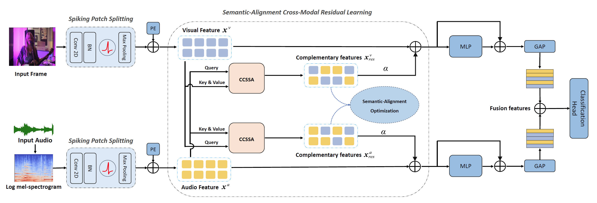

<div align="center">

<h2 class="papername"> Enhancing Audio-Visual Spiking Neural Networks through Semantic-Alignment and   Cross-Modal Residual Learning </h2>
<div>
<div>
    <a href="https://scholar.google.com/citations?user=Em5FqXYAAAAJ" target="_blank">Xiang He*</a>,
    <a href="https://scholar.google.com/citations?user=2E9Drq8AAAAJ" target="_blank">Dongcheng Zhao*</a>,
    <a href="https://scholar.google.com/citations?user=YLbBO9IAAAAJ" target="_blank">Yiting Dong</a>,
    <a href="https://scholar.google.com/citations?user=Sv-WdBkAAAAJ" target="_blank">Guobin Shen</a>,
    <a href="https://ieeexplore.ieee.org/author/37401423300" target="_blank">Xin Yang†</a>,
    <a href="https://scholar.google.com/citations?user=Rl-YqPEAAAAJ" target="_blank">Yi Zeng†</a>
</div>

Institute of Automation, Chinese Academy of Sciences, Beijing<br>
*Equal contribution
†Corresponding author

\[[arxiv](https://arxiv.org/abs/2502.12488)\] \[[paper]()\] \[[code](https://github.com/Brain-Cog-Lab/S-CMRL)\]

[](https://hits.seeyoufarm.com)

</div>
<br>

</div>

Here is the PyTorch implementation of our paper. 
If you find this work useful for your research, please kindly cite our paper and star our repo.

## Method

We construct a semantic-alignment cross-modal residual learning framework for multimodal SNNs. This framework provides an efficient feature fusion strategy and achieves state-of-the-art performance on three public datasets, demonstrating superior accuracy and robustness compared to existing methods. 



Comparison of S-CMRL with state-of-the-art methods on three datasets:


## Training Script

All experimental scripts can be found in [run_classification.sh](./SNN/run_classification.sh)

A sample script for our method on the CRMEA-D dataset is as follows：

```
CUDA_VISIBLE_DEVICES=0 python train_snn.py --model AVspikformer --dataset CREMAD --epoch 100 --batch-size 128 --num-classes 6 --step 4 --modality audio-visual --cross-attn --attn-method SpatialTemporal --alpha 1.5 --contrastive --temperature 0.07
```


The well-trained model weights and training logs are available [here]() to reproduce the results from the paper.


## Datasets

CREMA-D datasets：[CREMA-D](https://github.com/CheyneyComputerScience/CREMA-D)

UrbanSound8K-AV datasets: [UrbanSound8K-AV](https://github.com/Guo-Lingyue/SMMT)


## Citation
If our paper is useful for your research, please consider citing it:
```
@misc{he2025enhancingaudiovisualspikingneural,
      title={Enhancing Audio-Visual Spiking Neural Networks through Semantic-Alignment and Cross-Modal Residual Learning}, 
      author={Xiang He and Dongcheng Zhao and Yiting Dong and Guobin Shen and Xin Yang and Yi Zeng},
      year={2025},
      eprint={2502.12488},
      archivePrefix={arXiv},
      primaryClass={cs.CV},
      url={https://arxiv.org/abs/2502.12488}, 
}
```


## Acknowledgements

The UrbanSound8K-AV datasets used can be found in [SMMT](https://github.com/Guo-Lingyue/SMMT), thanks to their excellent work!  The SNN implementation is based on [Brain-Cog](https://github.com/BrainCog-X/Brain-Cog).  

If you are confused about using it or have other feedback and comments, please feel free to contact us via hexiang2021@ia.ac.cn. Have a good day!
